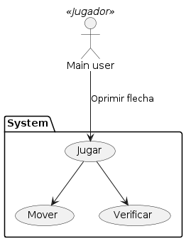

<h1 align="center">PUZZLE DESLIZANTE</h1>

**Descripción:** Juega un puzzle 3x3 muy entretenido con una interesante música de fondo. El objetivo del juego es que organices cada ficha en un orden numérico correcto.

**Instrucciones:** Para el movimiento se usan las flechas del teclado:
- ↑: Mover la ficha de arriba hacia el cuadro naranja sin número.
- ↓: Mover la ficha de abajo hacia el cuadro naranja sin número.
- ←: Mover la ficha de la izquierda hacia el cuadro naranja sin número.
- →: Mover la ficha de la derecha hacia el cuadro naranja sin número.

Cuando ganes te aparecerá un mensaje de felicitaciones y podrás volver a jugar abriendo y cerrando el juego de nuevo.

**Diagrama de casos de uso:**

**Desarrollado por:** David Felipe Gil Laverde  
**Lenguaje de programación:** Python  
**Universidad Distrital Francisco José de Caldas**
